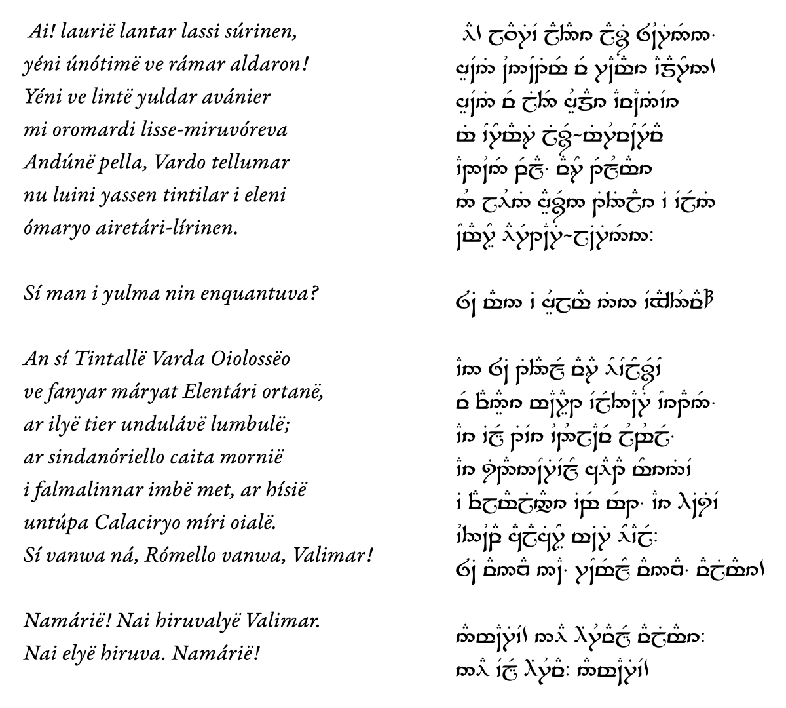

# Tengwar Yantaina

[](https://github.com/natewind/tengwar-yantaina/raw/master/yantaina.otf)

This is a modification of Tengwar Sindarin by Daniel Smith that includes a transcriber for [Classical Mode](https://at.boktypografen.se/teng_quenya.htm), built on OpenType substitutions. Just apply the font to any Quenya text and observe the magic:



Everything should work fine, but I haven’t tested it extensively, so bug reports are welcome!

## Tips

* S is always denoted by *silme*, since there’s no way for a font to understand etymology. If you want *súle* instead, you have to spell out TH.
* *Noldo* is not used anywhere by default, for the reason above and because no Classical Mode samples of it are known. Type Ñ if you want it anyway.
* To denote duodecimal 10 and 11, J and Z are used, since they’re the only Latin letters that never appear in transcriptions of Noldorin Quenya.

## TODO

* [ ] Test & fix stuff
* [ ] Use appropriate feature tags, not just `liga`
* [ ] Replace some substitutions with positioning
	* [ ] S-hook + tehta
	* [ ] Tengwa + tehta (no separate glyphs)
	* [ ] Diphtongs?
* [ ] Simplify stuff
	* [ ] Lookup flags: `lookupFlag IgnoreMarks; sub ...`
	* [ ] Chaining substitutions: `sub @classA @classB' lookup LookupName;`
	* [ ] Consider renaming basic consonant glyphs to `[a-z]`
* [ ] Combine glyphs for long vowels & diphtongs to simplify GSUB? (Learn hinting)
* [ ] Import issues ([tables reference](https://simoncozens.github.io/fonts-and-layout/opentype.html))
	* [ ] `Ignoring 'PCLT' PCL 5 data table`
	* [ ] `Windows will reject fonts with an OS/2 version number of 0`
* [ ] Export issues
	* [ ] Em size should be 1000, not 2048 for OpenType (not an error though)
	* [ ] Self-intersecting `eleven`
	* [ ] Missing BlueValues entry
* [ ] Double-stroked capital letters (version 2.0)

### Features Reference

* **Ligatures** (many-to-one)
	* [liga](https://learn.microsoft.com/en-us/typography/opentype/spec/features_ko#liga) — default
	* [rlig](https://learn.microsoft.com/en-us/typography/opentype/spec/features_pt#rlig) — required
	* [clig](https://learn.microsoft.com/en-us/typography/opentype/spec/features_ae#clig) — contextual
* **Contextual alternates** (one-to-one)
	* [calt](https://learn.microsoft.com/en-us/typography/opentype/spec/features_ae#calt) — default
	* [rclt](https://learn.microsoft.com/en-us/typography/opentype/spec/features_pt#rclt) — required
* **(De)composition:** [ccmp](https://learn.microsoft.com/en-us/typography/opentype/spec/features_ae#ccmp)
	* One-to-many
	* Many-to-one
* **Position**
	* [kern](https://learn.microsoft.com/en-us/typography/opentype/spec/features_ko#kern) — default
	* [dist](https://learn.microsoft.com/en-us/typography/opentype/spec/features_ae#dist) — required (does it work for Latin?)
	* [mark](https://learn.microsoft.com/en-us/typography/opentype/spec/features_ko#mark) — marks (tehtar)
	* [mkmk](https://learn.microsoft.com/en-us/typography/opentype/spec/features_ko#mkmk) — mark-to-mark (Y + vowels?)

```fea
pos @classA <left bottom extraWidth extraHeight> @classB <left bottom extraWidth extraHeight>;
pos A B marginBetween;
```

### Capital Letters

I plan to add double-stroked capital letters, but there are two problems:

* It’s not trivial to copy glyphs to another font with hinting (and other similar data?) preserved
* None of the original four typefaces have *tehtar* for capital letters (they need to be slightly bigger and higher)

To solve the first issue, I could just use a separate fallback font, but if anyone knows how to do it properly, please let me know. Or if you’re willing to create the *tehtar* variations (I’m not an actual type designer).
